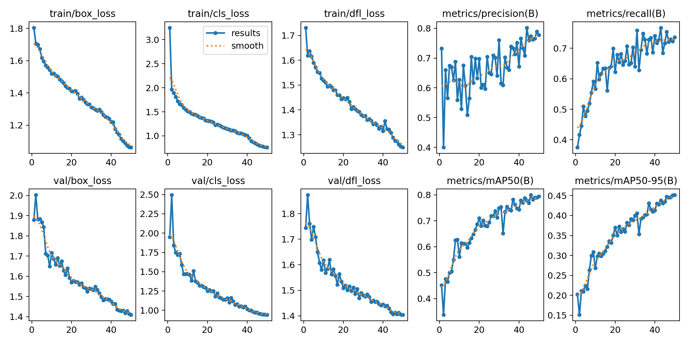
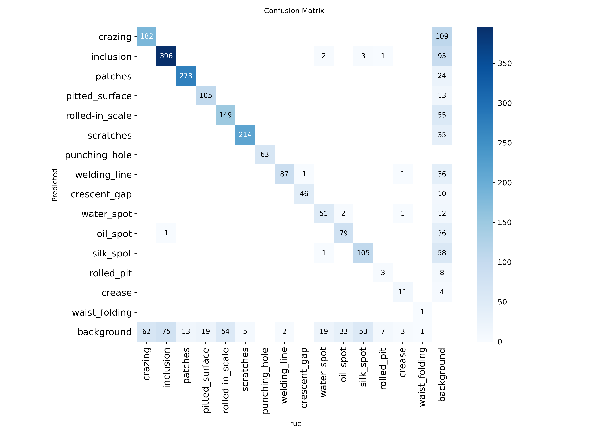

# Steel Defect Vision

A real-time steel surface defect detection system built with YOLOv8, trained on a merged dataset of NEU-DET and GC10-DET. The system detects 15 types of surface defects found in industrial steel manufacturing.

---

## Live Demo

[Launch App](https://steel-defect-vision.streamlit.app)

---

## Results

| Metric | Value |
|---|---|
| mAP50 | 0.7948 |
| mAP50-95 | 0.4558 |
| Precision | 0.7784 |
| Recall | 0.7365 |
| Training Time | 1.126 hours |
| Inference Speed | ~3.7 ms / image |




---

## Defect Classes (15)

| ID | Class | Source |
|---|---|---|
| 0 | crazing | NEU-DET |
| 1 | inclusion | NEU-DET + GC10-DET |
| 2 | patches | NEU-DET |
| 3 | pitted_surface | NEU-DET |
| 4 | rolled-in_scale | NEU-DET |
| 5 | scratches | NEU-DET |
| 6 | punching_hole | GC10-DET |
| 7 | welding_line | GC10-DET |
| 8 | crescent_gap | GC10-DET |
| 9 | water_spot | GC10-DET |
| 10 | oil_spot | GC10-DET |
| 11 | silk_spot | GC10-DET |
| 12 | rolled_pit | GC10-DET |
| 13 | crease | GC10-DET |
| 14 | waist_folding | GC10-DET |

---

## Dataset

| Dataset | Classes | Images |
|---|---|---|
| NEU-DET | 6 | 1,799 |
| GC10-DET | 10 | 2,161 |
| Combined | 15 | 3,960 |

- Train / Val split: 80 / 20
- Annotations: Pascal VOC XML converted to YOLO TXT format

---

## Model

- Architecture: YOLOv8s
- Framework: Ultralytics 8.4.46
- Input size: 640 x 640
- Epochs: 50
- Hardware: Tesla T4 GPU (Kaggle)
- Weights: `best.pt` (22.5 MB)

---

## Project Structure

```
steel-defect-vision/
├── app.py                  # Streamlit web application
├── simulate.py             # Conveyor belt simulation script
├── best.pt                 # Trained YOLOv8s weights
├── requirements.txt        # Python dependencies
├── results.png             # Training curves
└── confusion_matrix.png    # Confusion matrix
```

---

## Run Locally

```bash
git clone https://github.com/Ahsan-Neural/steel-defect-vision.git
cd steel-defect-vision

pip install -r requirements.txt

# Launch web app
streamlit run app.py

# Run conveyor belt simulation
python simulate.py --source data/samples --limit 20
```

---

## Requirements

```
ultralytics==8.4.46
streamlit>=1.32.0
opencv-python-headless>=4.9.0
Pillow>=10.0.0
numpy>=1.24.0
pandas>=2.0.0
```

---

## Author

**Muhammad Ahsan**
- GitHub: [Ahsan-Neural](https://github.com/Ahsan-Neural)
- Kaggle: [ahsanneural](https://www.kaggle.com/ahsanneural)


